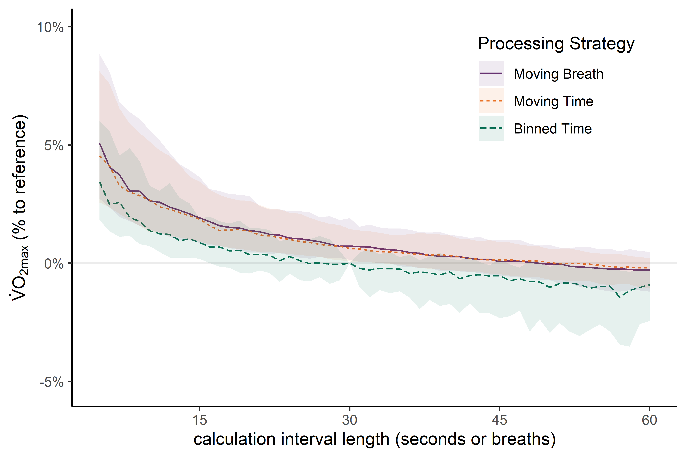
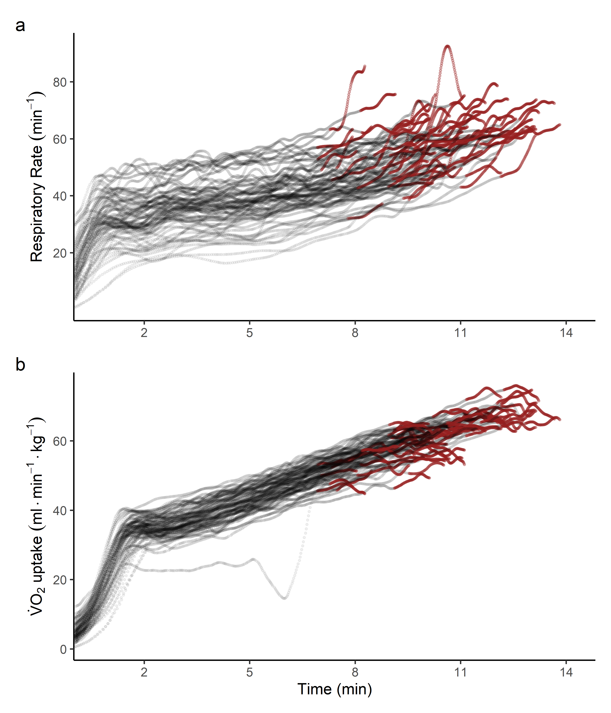

# Analysis Script for the Experimental Comparison

## Project: 'Data Processing Strategies to Determine Maximum Oxygen Uptake: A Systematic Scoping Review and Experimental Comparison'

This script closely follows the preregistration, which is uploaded on the [OSF](https://osf.io/3am4s).

```{r setup, warning = FALSE, message = FALSE}
knitr::opts_chunk$set(out.width = "70%", fig.align = "center")

# Packages used for the data workflow

library(purrr)
library(spiro)
library(tidyr)
library(ggplot2)
library(scales)
library(MetBrewer)
library(patchwork)
library(lmerTest)
library(broom.mixed)
library(multcomp)
library(ggdist)

# Get data files
files <- list.files("../data/ramptests", full.names = TRUE)

# ZAN raw data only saves imprecise body mass data in the raw data file.
info <- read.csv("../data/participants.csv")
```

## Functions to calculate VO2max using different strategies

```{r fuctions}
# Moving time average
max_time_moving <- function(data, parameter) {
  spiro::spiro_max(data = data, smooth = parameter)$VO2_rel
}

# Moving breath average
max_breath_moving <- function(data, parameter) {
  p <- paste0(parameter, "b")
  spiro::spiro_max(data = data, smooth = p)$VO2_rel
}

# Binned time average
max_time_binned <- function(data, parameter, max = TRUE) {
  nbin <- ceiling(nrow(data) / parameter)
  ibins <- seq(from = 1, by = parameter, length.out = nbin)
  binmean <- function(i, length, data) {
    values <- data$VO2_rel[i:(i + length - 1)]
    values[is.na(values)] <- 0
    mean(values)
  }
  binmeans <- purrr::map_dbl(.x = ibins, .f = binmean, length = parameter, data = data)
  if (max) max(binmeans) else binmeans
}

vo2max <- function(parameter, method, data) {
  if (method == "bm") {
    result <- max_breath_moving(data = data, parameter = parameter)
  } else if (method == "tm") {
    result <- max_time_moving(data = data, parameter = parameter)
  } else { # time binned
    result <- max_time_binned(data = data, parameter = parameter)
  }
  out <- data.frame(
    name = result
  )
  colnames(out) <- paste(method, parameter, sep = "_")
  out
}
```

## Iterate over all exercise tests

```{r calc, eval = FALSE}
# level 1: iterate over each data file
results <- purrr::map_dfr(
  .x = seq_along(files),
  .f = function(n) {
    # level 2: iterate over each processing method
    data <- spiro(files[n], weight = info$bodymass[n])
    purrr::map_dfc(
      .x = c("bm", "tm", "tb"), 
      .f = function(method, data) {
        # level 3: iterate over each parameter range
        purrr::map_dfc(
          .x = seq.int(5,60),
          .f = vo2max,
          method = method,
          data = data
        )
      }, 
      data = data
    )
  }
)

# write.csv(results, "../data/results.csv", row.names = FALSE)
```

## Plot: Comparison of various strategies 

### Normalize results

```{r norm}
res <- read.csv("../data/results.csv")

# Reference method: 30 seconds binned average
res_norm <- res / res$tb_30
res_norm$id <- as.factor(seq_len(nrow(res_norm)))
```

### Turn into tidy format

```{r wrangle}
res_tidy <- pivot_longer(
  data = res_norm, 
  cols = !id,
  names_to = c("type", "parameter"),
  names_pattern = "(.*)_(.*)",
  names_transform = list(
    parameter = ~ as.numeric(.x),
    type = ~ factor(.x, 
      levels = c("bm", "tm", "tb"), 
      labels = c("Moving Breath", "Moving Time", "Binned Time")
    )
  )
)

# calculate normalized results as percent difference
res_tidy$perdiff <- (res_tidy$value - 1) / 1
```

### Create comparison plot

```{r comparison, warning = FALSE}
# Function for calculating quantiles
quant <- function(data, lower, upper) {
  qs <- quantile(data, probs = c(lower, upper), names = FALSE)
  data.frame(
    ymin = qs[[1]],
    ymax = qs[[2]]
  )
}

p_comp_pre <- ggplot(res_tidy, aes(x = parameter, y = perdiff, colour = type, fill = type, linetype = type)) +
  geom_hline(
    yintercept = 0,
    colour = "grey",
    alpha = 0.3
  ) +
  stat_summary(geom = "line", fun = "median") +
  stat_summary(
    geom = "ribbon", 
    fun.data = "quant", 
    fun.args = list(lower = 0.1, upper = 0.9),
    alpha = 0.1, 
    colour = NA
  ) +
  scale_color_manual(
    name = "Processing Strategy",
    values = met.brewer("Java", 3)
  ) +
  scale_fill_manual(
    name = "Processing Strategy",
    values = met.brewer("Java", 3)
  ) +
  scale_linetype_discrete(
    name = "Processing Strategy"
  )

p_comp <- p_comp_pre +
  scale_x_continuous(
    name = "Parameter",
    breaks = c(15, 30, 45, 60)
  ) +
    scale_y_continuous(
    name = "% to Reference",
    labels = scales::percent,
    limits = c(-0.053,0.1)
  ) +
  theme_classic() +
  theme(
    legend.position = c(0.8,0.8)
  )

# ggsave("../plots/comparison.png", plot = p_comp, width = 6, height = 4, dpi = 600, bg = "white")

# save plot as EPS
# ggsave("../plots/comparison.pdf", plot = p_comp, width = 6, height = 4, dpi = 1200, bg = "white")

# create plot with different labels

p_comp_duration <- p_comp_pre +
  scale_x_continuous(
    name = "calculation interval length (seconds or breaths)",
    breaks = c(15, 30, 45, 60)
  ) +
  scale_y_continuous(
    name = expression(paste(dot(V), O[2][max], " (% to reference)")),
    labels = scales::percent,
    limits = c(-0.053,0.1)
  ) +
  theme_classic() +
  theme(
    legend.position = c(0.8,0.8)
  )
# ggsave("../plots/comparison_xlabel.png", plot = p_comp_duration, width = 6, height = 4, dpi = 600, bg = "white")
# ggsave("../plots/comparison_xlabel.pdf", plot = p_comp_duration, width = 6, height = 4, dpi = 1200, bg = "white")


```

## Plot: Respiratory rate and VO2 over time

```{r rr}
read_rr <- function(file) {
  dat <- spiro(file)
  # Zero-lag Butterworth filter with default parameters
  rr <- spiro_smooth(dat, smooth = "f", columns = "RR")[, 1]
  vo2 <- spiro_smooth(dat, smooth = "f", columns = "VO2")[, 1] / attr(dat, "info")$weight
  time <- attr(dat, "raw")$time
  load <- attr(dat, "raw")$load
  
  # file id
  filename_split <- strsplit(file, "/")[[1]]
  id <- filename_split[length(filename_split)]
  
  rr_df <- data.frame(
    id = id,
    time = time,
    value_rr = rr,
    value_vo2 = vo2,
    load = load,
    is_end = FALSE
  )
  
  # remove pre and post exercise data
  out <- rr_df[rr_df$load != 0, ]
  
  # mark last 60 seconds
  out$is_end[out$time >= (max(out$time) - 60)] <- TRUE
  
  out
}

# read all respiratory rate data
rr_all <- purrr::map_dfr(files, read_rr)

# Line plots with large data are very slow in ggplot2
# using a scatter plot instead
p_rr <- ggplot(rr_all, aes(x = time, y = value_rr, colour = is_end, alpha = is_end)) +
  geom_point(size = 0.5, show.legend = FALSE) +
  scale_colour_manual(values = c("black", met.brewer("Peru2")[2])) +
  scale_alpha_manual(values = c(0.05, 0.3)) +
  scale_x_continuous(
    name = NULL,
    limits = c(60,950),
    breaks = c(180, 360, 540, 720, 900),
    labels = c(2, 5, 8, 11, 14),
    expand = c(0,0)
  ) +
  scale_y_continuous(
    name = expression(paste("Respiratory Rate ", (min^-1))),
    breaks = c(20,40,60,80)
  ) +
  theme_classic()

p_vo2 <- ggplot(rr_all, aes(x = time, y = value_vo2, colour = is_end, alpha = is_end, group = id)) +
  geom_point(size = 0.5, show.legend = FALSE) +
  scale_colour_manual(values = c("black", met.brewer("Peru2")[2])) +
  scale_alpha_manual(values = c(0.05, 0.3)) +
  scale_x_continuous(
    name = "Time (min)",
    limits = c(60,950),
    breaks = c(180, 360, 540, 720, 900),
    labels = c(2, 5, 8, 11, 14),
    expand = c(0,0)
  ) +
  scale_y_continuous(
    name = expression(paste(dot(V), O[2], " uptake ", (ml%.%min^-1%.%kg^-1)))
  ) +
  theme_classic()

p_all <- p_rr / p_vo2 + plot_annotation(tag_levels = 'a')

# ggsave(filename = "../plots/timecourse.png", plot = p_all, width = 6, height = 7, dpi = 600, bg = "white")
# ggsave(filename = "../plots/timecourse.pdf", plot = p_all, width = 6, height = 7, dpi = 1200, bg = "white")

p_all_vert <- (p_rr | p_vo2) + plot_annotation(tag_levels = 'a')
# ggsave(filename = "../plots/timecourse_vert.png", plot = p_all_vert, width = 8, height = 3, dpi = 600, bg = "white")


```


## Plot: Example of different strategies

```{r example, warning = FALSE}
id <- 46
id_info <- read.csv("../data/participants.csv")
bodymass <- id_info$bodymass[id_info$p == id]

exm_data <- spiro(files[id])
raw_vo2 <- attr(exm_data, "raw")$VO2
raw_time <- attr(exm_data, "raw")$time
fz <- spiro_smooth(exm_data, "fz", "VO2")[,1]
mb <- spiro_smooth(exm_data, "30b", "VO2")[,1]
mt <- spiro_smooth(exm_data, 30, "VO2")[,1]
tb <- max_time_binned(exm_data, 30, max = FALSE) * attr(exm_data, "info")[["weight"]]
rb_time <- seq(from = 15, by = 30, length.out = length(tb))

exm_tidy <- data.frame(
  method = c(rep.int("raw", length(raw_vo2)), rep.int("fz", length(fz)), rep.int("mb", length(mb)), rep.int("mt", length(mt)), rep.int("tb", length(tb))),
  value = c(raw_vo2, fz, mb, mt, tb),
  time = c(rep.int(raw_time, 3), seq_along(mt), rb_time)
)

exm_tidy$method <- factor(
  exm_tidy$method, 
  levels = c("raw", "mb", "mt", "tb", "fz"), 
  labels = c("raw","Moving Breath","Moving Time","Binned Time", "Digital Filter"),
  ordered = TRUE
)
exm_tidy$value <- exm_tidy$value / bodymass

p_ex <- ggplot(exm_tidy, aes(x = time)) +
  geom_point(
    data = exm_tidy[exm_tidy$method == "raw", ], 
    aes(y = value, alpha = method, colour = "Raw Data")
  ) +
  geom_line(
    data = exm_tidy[exm_tidy$method %in% c("Moving Breath", "Moving Time", "Digital Filter"), ], 
    aes(y = value, color = method), 
    size = 0.7
  ) +
  geom_point(
    data = exm_tidy[exm_tidy$method == "Binned Time", ], 
    aes(y = value, fill = method, colour = "Binned Time"), 
    size = 1.4
  ) +
  scale_x_continuous(
    name = "Time (min)",
    limits = c(500,860),
    breaks = c(540, 630, 720),
    labels = c(8, 10, 12),
    expand = c(0,0)
  ) +
  scale_y_continuous(
    name = "VO2 (ml/min/kg)",
    limits = c(55,75)
  ) +
  scale_color_manual(
    name = "Processing Strategy",
    values = c(met.brewer("Java", 3)[3], "blue", met.brewer("Java", 3)[c(1,2)], "black"),
    labels = c("Raw Data", "Binned Time", "Digital Filter","Moving Time","Moving Breath"),
    guide = guide_legend(
      reverse = TRUE,
      override.aes = list(
        linetype = c(rep.int("solid", 3), "blank", "blank"),
        shape = c(rep.int(NA, 3), 19, 19),
        color = c(met.brewer("Java", 3)[c(1,2)], "blue", met.brewer("Java", 3)[3], "black"),
        alpha = c(rep.int(1, 4), 0.1)
      )
    )
  ) +
  scale_fill_manual(
    values = "white",
    guide = "none"
  ) +  scale_alpha_manual(
    values = 0.1,
    guide = "none"
  ) +
  theme_classic() +
  theme(
    legend.position = c(0.88, 0.63),
  )

# ggsave(filename = "../plots/example.png", plot = p_ex, width = 6, height = 4, dpi = 1200, bg = "white")

knitr::include_graphics("../plots/example.png")

## ECSS presentation plot
p2_raw <- ggplot(exm_tidy, aes(x = time)) +
  geom_point(
    data = exm_tidy[exm_tidy$method == "raw", ], 
    aes(y = value, alpha = method, colour = "Raw Data"),
    show.legend = FALSE
  ) +
  scale_x_continuous(
    name = "Time (min)",
    limits = c(500,820),
    breaks = c(540, 630, 720),
    labels = c(8, 10, 12),
    expand = c(0,0)
  ) +
  scale_y_continuous(
    name = expression(paste(dot(V), O[2], " ", (ml%.%min^-1%.%kg^-1))),
    limits = c(45,75)
  ) +
  scale_colour_manual(values = "black") +
  scale_fill_manual(
    values = "white",
    guide = "none"
  ) +  scale_alpha_manual(
    values = 0.3,
    guide = "none"
  ) +
  labs(title = "Raw data") +
  theme_classic(15) +
  theme(
    legend.position = c(0.88, 0.63),
  )

# ggsave(filename = "../plots/example2_raw.png", plot = p2_raw, width = 6, height = 4, dpi = 1200, bg = "white")

fz2 <- spiro_smooth(exm_data, "fz", "VO2")[,1]
mb2 <- spiro_smooth(exm_data, "7b", "VO2")[,1]
mt2 <- spiro_smooth(exm_data, 60, "VO2")[,1]
tb2 <- rep(max_time_binned(exm_data, 30, max = FALSE) * attr(exm_data, "info")[["weight"]], each = 30)

exm_tidy2 <- data.frame(
  method = c(rep.int("raw", length(raw_vo2)), rep.int("fz", length(fz2)), rep.int("mb", length(mb2)), rep.int("mt", length(mt2)), rep.int("tb", length(tb2))),
  value = c(raw_vo2, fz2, mb2, mt2, tb2),
  time = c(rep.int(raw_time, 3), seq_along(mt2), seq_along(tb2))
)

exm_tidy2$method <- factor(
  exm_tidy2$method, 
  levels = c("raw", "mb", "mt", "tb", "fz"), 
  labels = c("raw","Moving Breath","Moving Time","Binned Time", "Digital Filter"),
  ordered = TRUE
)
exm_tidy2$value <- exm_tidy2$value / bodymass


exm_tidy_cut <- exm_tidy2[exm_tidy2$time >= 500,]
exm_tidy_cut_copy <- exm_tidy_cut[exm_tidy_cut$method == "raw", ]
colnames(exm_tidy_cut_copy)[3] <- "timecopy"

create_gif <- function(type, title, color, savename) {
  out <- ggplot(exm_tidy_cut, aes(x = time)) +
  geom_point(
    data = exm_tidy_cut_copy, 
    aes(x = timecopy, y = value, alpha = method),
    color = "black",
    show.legend = FALSE,
    size = 1.5
  ) +
  geom_line(
    data = exm_tidy_cut[exm_tidy_cut$method %in% c(type), ], 
    aes(y = value, color = method), 
    size = 1.3,
    show.legend = FALSE,
    color = color
  ) +
  scale_x_continuous(
    name = "Time (min)",
    limits = c(500,820),
    breaks = c(540, 630, 720),
    labels = c(8, 10, 12),
    expand = c(0,0)
  ) +
  scale_y_continuous(
    name = expression(paste(dot(V), O[2], " ", (ml%.%min^-1%.%kg^-1))),
    limits = c(45,75)
  ) +
  scale_alpha_manual(
    values = 0.3,
    guide = "none"
  ) +
  labs(
    title = title
  ) +
  theme_classic(15) +
  theme(
    legend.position = c(0.88, 0.63),
    plot.title = element_text(colour = color)
  ) +
  gganimate::transition_reveal(time)
  gganimate::anim_save(
    paste0("../plots/", savename, ".gif"), out, fps = 25,
    res = 300, width = 6.5, height = 4.5, units = "in" # passed to grDevices::png()
  ) 
}

#create_gif("Moving Breath", "7-breath moving (Robergs & Burnett 2003)", "darkgreen", "anim1")
#create_gif("Moving Time", "60-s moving (Howley et al. 1995)", "purple", "anim2")
#create_gif("Digital Filter", "Digital Filter (Robergs et al. 2010)", "orange", "anim3")
#create_gif("Binned Time", "30-s binned", "turquoise3", "anim4")

# ECSS all methods suppl. plot

allplot <- ggplot(exm_tidy_cut, aes(x = time)) +
  geom_point(
    data = exm_tidy_cut_copy, 
    aes(x = timecopy, y = value, alpha = method),
    color = "black",
    show.legend = FALSE,
    size = 1.5
  ) +
  geom_line(
    data = exm_tidy_cut[exm_tidy_cut$method %in% c("Moving Breath", "Moving Time", "Digital Filter", "Binned Time"), ], 
    aes(y = value, color = method), 
    size = 1.3
  ) +
  scale_x_continuous(
    name = "Time (min)",
    limits = c(500,800),
    breaks = c(540, 630, 720),
    labels = c(8, 10, 12),
    expand = c(0,0)
  ) +
  scale_y_continuous(
    name = expression(paste(dot(V), O[2], " ", (ml%.%min^-1%.%kg^-1))),
    limits = c(45,75)
  ) +
  scale_alpha_manual(
    values = 0.3,
    guide = "none"
  ) +
  scale_color_manual(
    name = "Method",
    values = c("darkgreen", "purple", "orange", "turquoise2")
  ) +
  theme_classic(15)

#ggsave("../plots/allplot.png", plot = allplot, dpi = 300, width = 7.5, height = 4.5, bg = "white")
```

## Calculate zero phase digital filter

```{r}
# Function to get VO2max with digital filtering
get_fzmax <- function(i) {
  dta <- spiro(files[i], weight = info$bodymass[i])
  spiro_max(dta, smooth = "0.04fz3")$VO2_rel
}

get_fmax <- function(i) {
  dta <- spiro(files[i], weight = info$bodymass[i])
  spiro_max(dta, smooth = "0.04f3")$VO2_rel
}

# iterate over all tests
fzmax <- purrr::map_dbl(seq_along(files), get_fzmax)
fmax <- purrr::map_dbl(seq_along(files), get_fmax)

# normalize to reference procedure
fzmax_norm <- fzmax / res$tb_30

# get median and quantile values
median(fzmax_norm)
#quant(fzmax_norm, 0.1, 0.9)
mean(fmax)
sd(fmax)
```

## Statistical comparison of selected strategies

```{r}
res <- read.csv("../data/results.csv")

slct <- data.frame(
  id = seq_len(nrow(res)),
  bm_07 = res$bm_7,
  bm_15 = res$bm_15,
  tb_30 = res$tb_30,
  filt = fmax,
  tm_30 = res$tm_30,
  tb_60 = res$tb_60
)

slct_long <- tidyr::pivot_longer(slct, cols = -id)

slct_long$name <- factor(
  slct_long$name, 
  levels = names(sort(apply(slct[,-1],2,mean))),
  labels = c("(f) 60-s binned", "(e) 30-s binned","(d) 30-s moving","(c) digital filter","(b) 15-breath moving","(a) 7-breath moving"))

# plot with individual data
p_selcomp <- ggplot(slct_long, aes(x = value, y = name)) +
  geom_line(aes(group = id), orientation = "y", colour = "grey80") +
  stat_dotsinterval(
    alpha = 0.7, 
    .width = c(0.33, 0.66), 
    binwidth = 0.5, dotsize = 1,
    point_interval = "mean_qi"
    ) +
  scale_x_continuous(
    name = expression(paste(dot(V), O[2][max], " ", (ml%.%min^-1%.%kg^-1))),
    expand = c(0.02,0.02),
    breaks = seq(50,75,5),
    labels = c("50","","60","","70","")
  ) +
  scale_y_discrete(
    name = NULL,
    expand = c(0.05,0.1)
  ) +
  theme_classic(base_size = 14) +
  theme(
    axis.line.y = element_blank(),
    axis.text.y = element_text(colour = "black")
  )

mod <- lmer(value ~ name + (1 | id), slct_long)
anova(mod)

summary(glht(mod, linfct = mcp(name = "Tukey")), test = adjusted(type = "single-step"))

# ggsave(filename = "../plots/sel_comp.pdf", width = 8, height = 5, dpi = 600, bg = "white")
# ggsave(filename = "../plots/sel_comp.png", width = 8, height = 5, dpi = 600, bg = "white")

p_selcomp


# calculate place for significance symbol
get_mean_plus <- function(i) {
  mean(slct_long$value[slct_long$name == slct_long$name[i]], 0.9) + 6.5
}
slct_long$place <- map_dbl(seq_len(nrow(slct_long)), get_mean_plus)

get_symbol <- function(i) {
  ifelse(
    slct_long$name[i] %in% c("(d) 30-s moving", "(c) digital filter"),"#","*"
  )
}
get_vjust <- function(i) {
  ifelse(
    slct_long$name[i] %in% c("(d) 30-s moving", "(c) digital filter"), 0.3 ,0.6
  )
}
slct_long$symbol <- map_chr(seq_len(nrow(slct_long)), get_symbol)
slct_long$vjust <- map_dbl(seq_len(nrow(slct_long)), get_vjust)
# plot without individual data
p_selcomp2 <- ggplot(slct_long, aes(x = value, y = name)) +
  stat_pointinterval(
    alpha = 0.7, 
    .width = c(0.33, 0.66), 
    point_interval = "mean_qi"
  ) +
  geom_text(
    aes(x = place, label = symbol, vjust = vjust), 
    show.legend = FALSE
  ) +
  scale_x_continuous(
    name = expression(paste(dot(V), O[2][max], " ", (ml%.%min^-1%.%kg^-1))),
    expand = c(0.02,0.02),
    breaks = seq(52.5,72.5,2.5),
    labels = c("","55","","60","","65","","70","")
  ) +
  scale_y_discrete(
    name = NULL,
    expand = c(0.05,0.1)
  ) +
  theme_classic(base_size = 14) +
  theme(
    axis.line.y = element_blank(),
    axis.text.y = element_text(colour = "black")
  )

p_selcomp2

# ggsave(filename = "../plots/sel_comp2.pdf", width = 7, height = 3, dpi = 600, bg = "white")
# ggsave(filename = "../plots/sel_comp2.png", width = 7, height = 3.5, dpi = 600, bg = "white")


```

## Compare impact of binning preprocessing on VO2max

```{r}
# normal time binned
max_time_binned <- function(data, parameter, max = TRUE) {
  nbin <- ceiling(nrow(data) / parameter)
  ibins <- seq(from = 1, by = parameter, length.out = nbin)
  binmean <- function(i, length, data) {
    values <- data$VO2_rel[i:(i + length - 1)]
    values[is.na(values)] <- 0
    mean(values)
  }
  binmeans <- purrr::map_dbl(.x = ibins, .f = binmean, length = parameter, data = data)
  if (max) max(binmeans) else binmeans
}

max_time_binned_late <- function(data, parameter, max = TRUE) {
  raw <- attr(data, "raw")
  last_load <- round(raw$time[max(which(raw$load != 0))])
  nbin <- ceiling(last_load / parameter)
  ibins <- seq(to = last_load, by = parameter, length.out = nbin)
  binmean <- function(i, length, data) {
    values <- data$VO2_rel[i:(i + length - 1)]
    values[is.na(values)] <- 0
    mean(values)
  }
  binmeans <- purrr::map_dbl(.x = ibins, .f = binmean, length = parameter, data = data)
  if (max) max(binmeans) else binmeans
}

max_time_binned_noninterp <- function(data, parameter, max = TRUE) {
  raw <- attr(data, "raw")
  nbin <- ceiling(nrow(data) / parameter)
  ibins <- seq(from = 0, by = parameter, length.out = nbin)
  binmean <- function(i, length, data) {
    raw <- attr(data, "raw")
    values <- raw$VO2[raw$time >= ibins[i] & raw$time <= (ibins[i]+length)] / attr(data, "info")$weight
    values[is.na(values)] <- 0
    mean(values)
  }
  binmeans <- purrr::map_dbl(.x = seq_along(ibins), .f = binmean, length = parameter, data = data)
  if (max) max(binmeans) else binmeans
}


get_vo2max <- function(n, parameter = 30) {
  data <- spiro(files[n], weight = info$bodymass[n])
  data.frame(
    begin = max_time_binned(data = data, parameter = parameter),
    end = max_time_binned_late(data = data, parameter = parameter),
    nonint = max_time_binned_noninterp(data = data, parameter = parameter)
  )
}

o <- purrr::map_dfr(seq_along(files), get_vo2max)
o$dif_align <- o$begin - o$end
o$dif_interp <- o$begin - o$nonint
apply(o, 2, mean)
apply(o, 2, sd)

```

## Plot for article: Visualizing different strategies in one raw data set

```{r example, warning = FALSE}
plot_data <- function(id, show_legend = TRUE, show_ylabel = TRUE) {
id_info <- read.csv("../data/participants.csv")
bodymass <- id_info$bodymass[id_info$p == id]

exm_data <- spiro(files[id])
raw_vo2 <- attr(exm_data, "raw")$VO2
raw_time <- attr(exm_data, "raw")$time

fz2 <- spiro_smooth(exm_data, "fz", "VO2")[,1]
mb2 <- spiro_smooth(exm_data, "7b", "VO2")[,1]
mt2 <- spiro_smooth(exm_data, 30, "VO2")[,1]
tb2 <- rep(max_time_binned(exm_data, 60, max = FALSE) * attr(exm_data, "info")[["weight"]], each = 60)

exm_tidy2 <- data.frame(
  method = c(rep.int("raw", length(raw_vo2)), rep.int("fz", length(fz2)), rep.int("mb", length(mb2)), rep.int("mt", length(mt2)), rep.int("tb", length(tb2))),
  value = c(raw_vo2, fz2, mb2, mt2, tb2),
  time = c(rep.int(raw_time, 3), seq_along(mt2), seq_along(tb2))
)

exm_tidy2$method <- factor(
  exm_tidy2$method, 
  levels = c("raw", "mb", "mt", "tb", "fz"), 
  labels = c("raw","7-breath moving","30-s moving","60-s binned", "digital filter"),
  ordered = TRUE
)
exm_tidy2$value <- exm_tidy2$value / bodymass


exm_tidy_cut <- exm_tidy2[exm_tidy2$time >= 500,]
exm_tidy_cut_copy <- exm_tidy_cut[exm_tidy_cut$method == "raw", ]
colnames(exm_tidy_cut_copy)[3] <- "timecopy"

allplot <- ggplot(exm_tidy_cut, aes(x = time)) +
  geom_point(
    data = exm_tidy_cut_copy, 
    aes(x = timecopy, y = value, alpha = method),
    color = "black",
    alpha = 0.15,
    show.legend = FALSE,
    size = 1.5
  ) +
  geom_line(
    data = exm_tidy_cut[exm_tidy_cut$method %in% c("7-breath moving", "30-s moving", "digital filter", "60-s binned"), ], 
    aes(y = value, color = method, linetype = method), 
    size = 0.9,
    show.legend = show_legend
  ) +
  scale_x_continuous(
    name = "Time (min)",
    limits = c(520,800),
    breaks = c(540, 660, 780),
    labels = c(8, 10, 12),
    expand = c(0,0)
  ) +
    scale_y_continuous(
      name = ifelse(show_ylabel, expression(paste(dot(V), O[2], " ", (ml%.%min^-1%.%kg^-1))), ""),
      limits = c(45,80)
    ) +
  scale_color_manual(
    name = "Method",
    values = c("darkgreen", "purple", "orange", "turquoise2")
  ) +
  scale_linetype_manual(name = "Method", values = c("solid", "dashed", "longdash", "dotted")) +
  theme_classic(12) +
  theme(legend.position = "top")

allplot
}


guide_area() / (plot_data(53, show_legend = FALSE) | plot_data(61, show_ylabel = FALSE)) + plot_layout(guides = 'collect', heights = c(1,6)) + plot_annotation(tag_levels = 'a') & theme(legend.position = "top") 


#ggsave("../plots/allplot_article.png", dpi = 300, width = 7, height = 4, bg = "white")
#ggsave("../plots/allplot_article.pdf", dpi = 300, width = 7, height = 4, bg = "white")
```

### Difference between filter and 30-s moving average
```{r}
res <- read.csv("../data/results.csv")
ba <- data.frame(
  f = fmax,
  m = res$tm_30
)

ba$dif <- ba$f - ba$m

mean(ba$dif)
sd(ba$dif)
```

