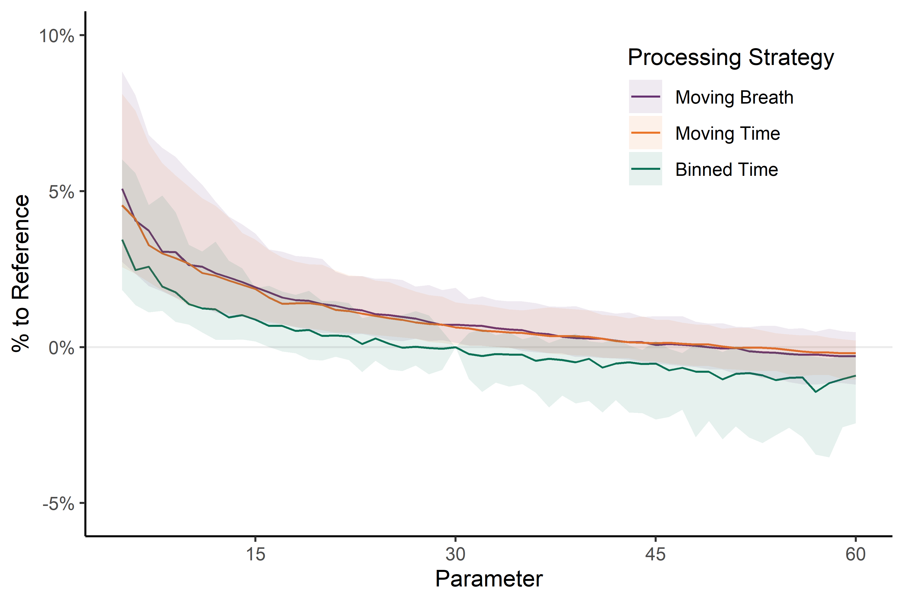
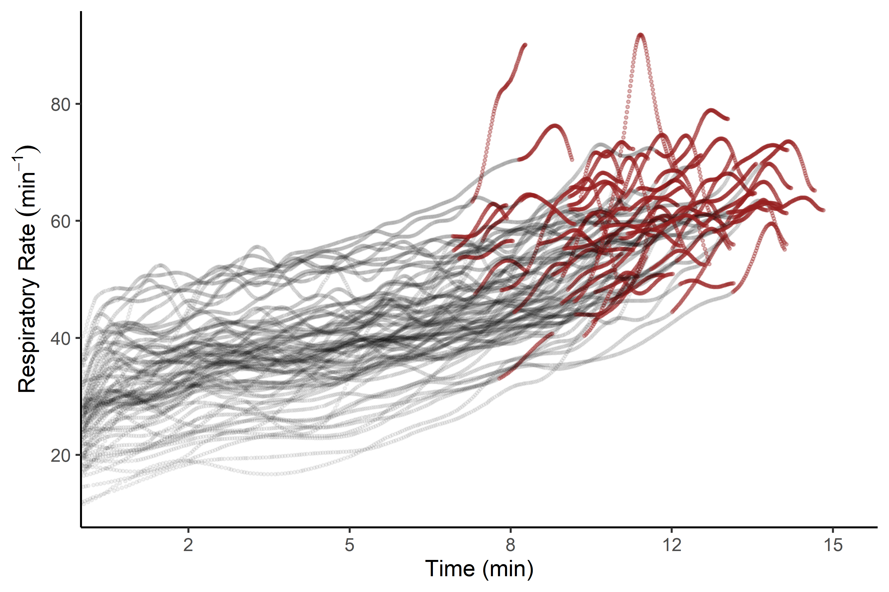
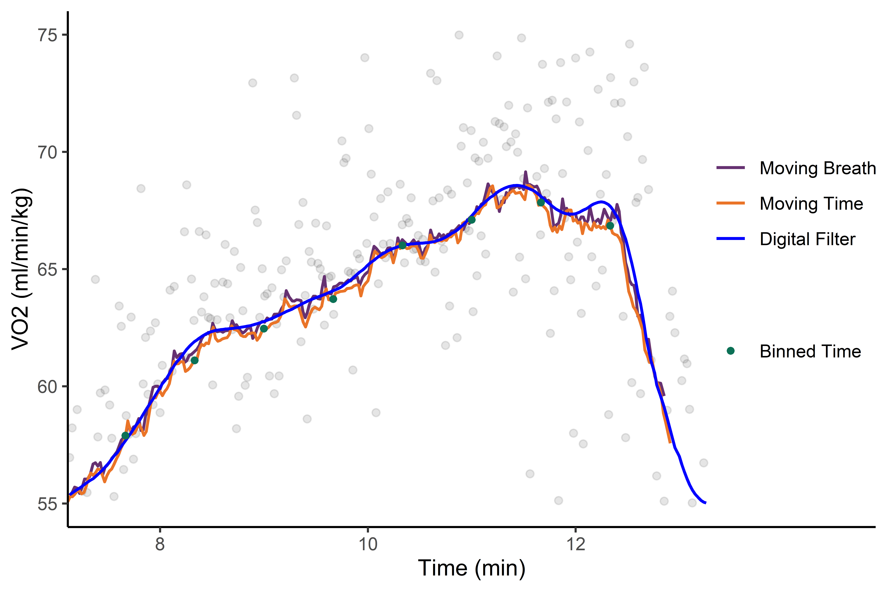

# Analysis Script for the Experimental Comparison

## Project: ‘Data Processing Strategies to Determine Maximum Oxygen Uptake: A Systematic Scoping Review and Experimental Comparison’

This script closely follows the preregistration, which is uploaded on
the [OSF](https://osf.io/3am4s).

``` r
knitr::opts_chunk$set(out.width = "70%", fig.align = "center")

# Packages used for the data workflow

library(purrr)
library(spiro)
library(tidyr)
library(ggplot2)
library(scales)
```

    ## 
    ## Attaching package: 'scales'

    ## The following object is masked from 'package:purrr':
    ## 
    ##     discard

``` r
library(MetBrewer)

# Get data files

files <- list.files("../data/ramptests", full.names = TRUE)
```

## Functions to calculate VO2max using different strategies

``` r
# Moving time average
max_time_moving <- function(data, parameter) {
  spiro::spiro_max(data = data, smooth = parameter)$VO2_rel
}

# Moving breath average
max_breath_moving <- function(data, parameter) {
  p <- paste0(parameter, "b")
  spiro::spiro_max(data = data, smooth = p)$VO2_rel
}

# Binned time average
max_time_binned <- function(data, parameter, max = TRUE) {
  nbin <- ceiling(nrow(data) / parameter)
  ibins <- seq(from = 1, by = parameter, length.out = nbin)
  binmean <- function(i, length, data) {
    values <- data$VO2_rel[i:(i + length - 1)]
    values[is.na(values)] <- 0
    mean(values)
  }
  binmeans <- purrr::map_dbl(.x = ibins, .f = binmean, length = parameter, data = data)
  if (max) max(binmeans) else binmeans
}

vo2max <- function(parameter, method, data) {
  if (method == "bm") {
    result <- max_breath_moving(data = data, parameter = parameter)
  } else if (method == "tm") {
    result <- max_time_moving(data = data, parameter = parameter)
  } else { # time binned
    result <- max_time_binned(data = data, parameter = parameter)
  }
  out <- data.frame(
    name = result
  )
  colnames(out) <- paste(method, parameter, sep = "_")
  out
}
```

## Iterate over all exercise tests

``` r
# ZAN raw data only saves imprecise body mass data in the raw data file.
info <- read.csv("../data/participants.csv")

# level 1: iterate over each data file
results <- purrr::map_dfr(
  .x = seq_along(files),
  .f = function(n) {
    # level 2: iterate over each processing method
    data <- spiro(files[n], weight = info$bodymass[n])
    purrr::map_dfc(
      .x = c("bm", "tm", "tb"), 
      .f = function(method, data) {
        # level 3: iterate over each parameter range
        purrr::map_dfc(
          .x = seq.int(5,60),
          .f = vo2max,
          method = method,
          data = data
        )
      }, 
      data = data
    )
  }
)

# write.csv(results, "../data/results.csv", row.names = FALSE)
```

## Normalize results

``` r
res <- read.csv("../data/results.csv")

# Reference method: 30 seconds binned average
res_norm <- res / res$tb_30
res_norm$id <- as.factor(seq_len(nrow(res_norm)))
```

## Turn into tidy format

``` r
res_tidy <- pivot_longer(
  data = res_norm, 
  cols = !id,
  names_to = c("type", "parameter"),
  names_pattern = "(.*)_(.*)",
  names_transform = list(
    parameter = ~ as.numeric(.x),
    type = ~ factor(.x, 
      levels = c("bm", "tm", "tb"), 
      labels = c("moving breath", "moving time", "binned time")
    )
  )
)

# calculate normalized results as percent difference
res_tidy$perdiff <- (res_tidy$value - 1) / 1
```

## Plot: Comparison of processing strategies

``` r
# Function for calculating quantiles
quant <- function(data, lower, upper) {
  qs <- quantile(data, probs = c(lower, upper), names = FALSE)
  data.frame(
    ymin = qs[[1]],
    ymax = qs[[2]]
  )
}

p_comp <- ggplot(res_tidy, aes(x = parameter, y = perdiff, colour = type, fill = type)) +
  geom_hline(
    yintercept = 0,
    colour = "grey",
    alpha = 0.3
  ) +
  stat_summary(geom = "line", fun = "median") +
  stat_summary(
    geom = "ribbon", 
    fun.data = "quant", 
    fun.args = list(lower = 0.1, upper = 0.9),
    alpha = 0.1, 
    colour = NA
  ) +
  scale_x_continuous(
    name = "Parameter",
    breaks = c(15, 30, 45, 60)
  ) +
  scale_y_continuous(
    name = "% to Reference",
    labels = scales::percent,
    limits = c(-0.053,0.1)
  ) +
  scale_color_manual(
    values = met.brewer("Java", 3)
  ) +
  scale_fill_manual(
    values = met.brewer("Java", 3)
  ) +
  theme_classic() +
  theme(
    legend.position = c(0.8,0.8)
  )

# ggsave(p_comp, "../plots/comparison.png", width = 6, height = 4, dpi = 600, bg = "white")


```


## Plot: Respiratory Rate over time

``` r
read_rr <- function(file) {
  dat <- spiro(file)
  # Zero-lag Butterworth filter with default parameters
  rr <- spiro_smooth(dat, smooth = "fz", columns = "RR")[, 1]
  time <- attr(dat, "raw")$time
  load <- attr(dat, "raw")$load
  
  # file id
  filename_split <- strsplit(file, "/")[[1]]
  id <- filename_split[length(filename_split)]
  
  rr_df <- data.frame(
    id = id,
    time = time,
    value = rr,
    load = load,
    is_end = FALSE
  )
  
  # remove pre and post exercise data
  out <- rr_df[rr_df$load != 0, ]
  
  # mark last 60 seconds
  out$is_end[out$time >= (max(out$time) - 60)] <- TRUE
  
  out
}

# read all respiratory rate data
rr_all <- purrr::map_dfr(files, read_rr)

# Line plots with large data are very slow in ggplot2
# using a scatter plot instead
p_rr <- ggplot(rr_all, aes(x = time, y = value, colour = is_end, alpha = is_end)) +
  geom_point(size = 0.5, show.legend = FALSE) +
  scale_colour_manual(values = c("black", met.brewer("Peru2")[2])) +
  scale_alpha_manual(values = c(0.05, 0.3)) +
  scale_x_continuous(
    name = "Time (min)",
    limits = c(60,950),
    breaks = c(180, 360, 540, 720, 900),
    labels = c(2, 5, 8, 12, 15),
    expand = c(0,0)
  ) +
  scale_y_continuous(
    name = expression(paste("Respiratory Rate ", (min^-1))),
    breaks = c(20,40,60,80)
  ) +
  theme_classic()

# ggsave(p_rr, filename = "../plots/rr.png", width = 6, height = 4, dpi = 600, bg = "white")


```


## Plot: Example of different strategies

``` r
id <- 46
id_info <- read.csv("../data/participants.csv")
bodymass <- id_info$bodymass[id_info$p == id]

exm_data <- spiro(files[id])
raw_vo2 <- attr(exm_data, "raw")$VO2
raw_time <- attr(exm_data, "raw")$time
fz <- spiro_smooth(exm_data, "fz", "VO2")[,1]
mb <- spiro_smooth(exm_data, "30b", "VO2")[,1]
mt <- spiro_smooth(exm_data, 30, "VO2")[,1]
tb <- max_time_binned(exm_data, 30, max = FALSE) * attr(exm_data, "info")[["weight"]]
rb_time <- seq(from = 15, by = 30, length.out = length(tb))

exm_tidy <- data.frame(
  method = c(rep.int("raw", length(raw_vo2)), rep.int("fz", length(fz)), rep.int("mb", length(mb)), rep.int("mt", length(mt)), rep.int("tb", length(tb))),
  value = c(raw_vo2, fz, mb, mt, tb),
  time = c(rep.int(raw_time, 3), seq_along(mt), rb_time)
)

exm_tidy$method <- factor(
  exm_tidy$method, 
  levels = c("raw", "mb", "mt", "tb", "fz"), 
  labels = c("raw", "Moving Breath", "Moving Time", "Binned Time", "Digital Filter")
)
exm_tidy$value <- exm_tidy$value / bodymass

p_ex <- ggplot(exm_tidy, aes(x = time)) +
  geom_point(data = exm_tidy[exm_tidy$method == "raw", ], aes(y = value), alpha = 0.1) +
  geom_line(data = exm_tidy[exm_tidy$method %in% c("Moving Time", "Moving Breath", "Digital Filter"), ], aes(y = value, color = method), size = 0.7) +
  geom_point(data = exm_tidy[exm_tidy$method == "Binned Time", ], aes(y = value, fill = method), color = met.brewer("Java", 3)[3], size = 1.2) +
  scale_x_continuous(
    name = "Time (min)",
    limits = c(500,850),
    breaks = c(540, 630, 720),
    labels = c(8, 10, 12),
    expand = c(0,0)
  ) +
  scale_y_continuous(
    name = "VO2 (ml/min/kg)",
    limits = c(55,75)
  ) +
  scale_color_manual(
    name = "",
    values = c(met.brewer("Java", 3)[1:2], "blue")
  ) +
   scale_fill_manual(
    name = "",
    values = "white"
  ) +
  theme_classic() +
  theme(
    legend.position = c(0.9, 0.55),
  )

# ggsave(p_ex, filename = "../plots/example.png", width = 6, height = 4, dpi = 1200, bg = "white")


```


