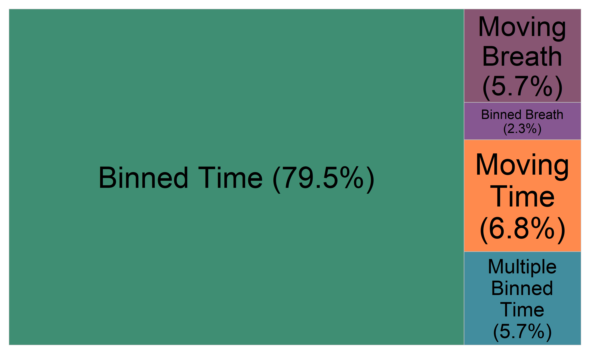
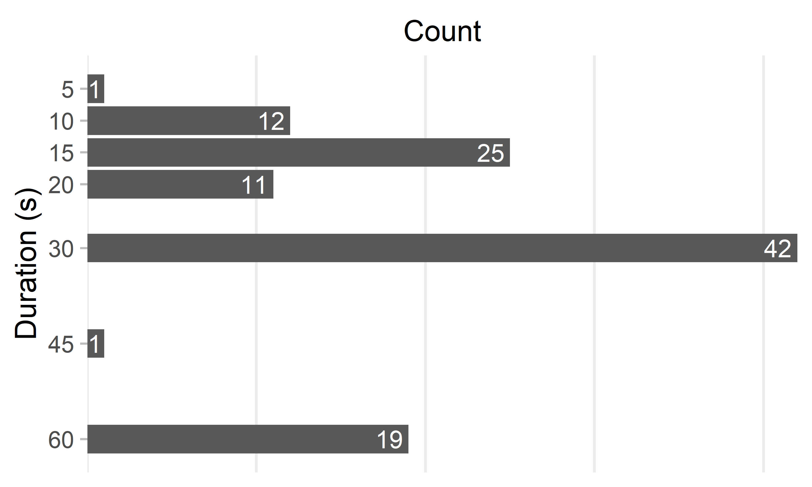

# Results

## Systematic Scoping Review

Initial search yielded 7529 results of which 4364 remained after automated filtering and removal of duplicates (see flow diagram in Figure 1). Out of the random sample (n = 500), 244 articles were included in the final analysis.

![Flow diagram for the systematic scoping review in accordance with the PRISMA 2020 Statement [@page2021]](../plots/flow_diagram.png)

Reporting practices of the methodology of gas exchange measures differed widely within the literature (see Table 4). More than half (51.8%) of the articles did not report any information on their data processing strategy. Only one in twenty articles (5.4%) provided a rationale for their used strategy.

```{r reporting-table, echo=FALSE}
load("../data/reporting.Rda")
t <- purrr::map_dfr(reporting, scales::percent, accuracy = 0.1)

t[["pre"]] <- paste0(t[["pre"]], "*")
t[["software"]] <- paste0(t[["software"]], "*")

knitr::kable(
  t,
  col.names = c("Metabolic cart", "Preprocessing", "Software", "Processing Strategy", "Reference"),
  caption = "Percentage of studies that provided details on the different characteristics of oxygen uptake data processing. *only examined within the subgroup of studies using breath-by-breath measurements",
  align = "r"
)
```

Out of the authors that provided information and collected breath-by-breath measurements most (79.5%) utilized binned averages to determine V̇O~2max~. Moving time averages, or breath-based averages were uncommon (see Figure 2). No study used digital filtering methods to determine V̇O~2max~.



The calculation interval for time-based averages of mixing chamber and breath-by-breath devices ranged from 5 to 60 seconds (see Figure 3). 30 second length intervals were most common to define V̇O~2max~, while authors also often employed shorter (10-20s) and longer (60s) periods.



## Experimental Comparison


